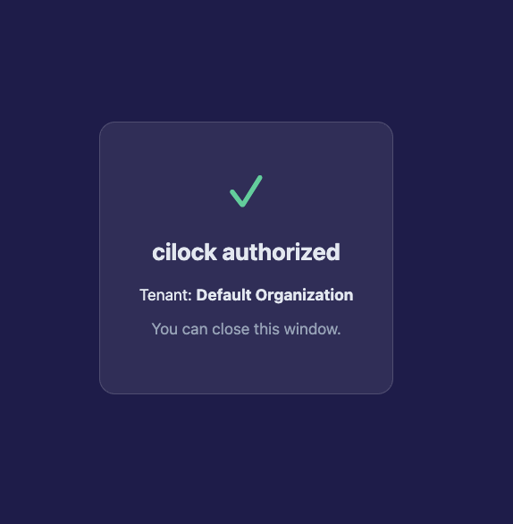

# Runbook — Securing the Hugo fork's supply chain with cilock

End-to-end walkthrough for taking an upstream project (Hugo), wrapping its build
in **cilock** attestations, and gating releases against a signed policy. Two
trust tiers are covered:

1. **Offline / local key** — reproducible on any laptop, no platform account.
   Earns SLSA **Build L1** + the cryptographic *content* of L2.
2. **Keyless / platform** — isolated GitHub Actions runner, workflow OIDC
   identity, Fulcio + TSA + Archivista. The path to SLSA **Build L2/L3**.

Steps tagged **[terminal]** happen in the cilock CLI (driven here by Claude);
steps tagged **[browser]** happen on the TestifySec platform web UI. Terminal
transcripts below are the real output captured during this build; browser steps
use real screenshots.

---

## Prerequisites

| Tool | Version used | Note |
|---|---|---|
| cilock | 3.0.0 | installed + provenance-verified in Step 1 |
| Go | 1.26.3 | builds Hugo |
| syft | 0.70 | CycloneDX SBOM |
| trivy | 0.70 | CVE scan |
| gh | 2.x | GitHub repo + CI |
| Chrome | — | private window for the platform login |

---

## Step 1 — Download and verify cilock  **[terminal]**

Do **not** `curl … | bash`. Download the installer, read it, and let it verify
the archive SHA-256 against the signed manifest. Then verify the binary's own
provenance against the platform-signed release policy.

```console
$ curl -fsSL https://cilock.dev/dl/manifest.json | jq -r .latest
v3.0.0

$ shasum -a 256 cilock-3.0.0-darwin-arm64.tar.gz
fc4af7bac12b0caac9642283da63e30982c14a0d96879de72e0a27756c9ddd9c  cilock-3.0.0-darwin-arm64.tar.gz
# ^ matches the manifest entry exactly

$ cilock verify ./cilock -p release-policy.json --enable-archivista
level=info msg="policy signature verified"
level=info msg="Verification succeeded"
verified: sha256:368797cf…120a30 bound to step "build" as a product/material leaf "cilock"
# exit 0 — provenance verified, not just a checksum
```

The release policy's trust anchors (TestifySec Fulcio CA, TSA, signer identity)
are compiled into the binary, so no `--policy-*` flags are needed.

---

## Step 2 — Fork (clone) Hugo  **[terminal]**

```console
$ git clone --depth 1 --branch v0.162.1 https://github.com/gohugoio/hugo.git hugo-internal
$ git -C hugo-internal rev-parse HEAD
bba860e3eda3091efe8c6d1a96bc49a29ad2d5f6
```

---

## Step 3 — Offline secured-release pipeline  **[terminal]**

One script wraps every stage in `cilock run`/`attest`, signs a Witness policy,
and gates the binary — fully offline with a local ECDSA P-256 key.

```console
$ bash supply-chain/secure-release.sh
=== 1/7 source — pin commit + build env ===
=== 2/7 build — go build, Go provenance + SLSA ===
=== 3/7 sbom — CycloneDX of the binary's module graph ===
=== 4/7 vuln-scan — trivy over the SBOM -> SARIF ===
=== 5/7 validate — offline binary integrity ===
=== 6/7 policy — generate + sign the release gate ===
=== 7/7 verify — gate the binary, then prove fail-closed ===
  PASS: hugo binary satisfies the signed policy
  GOOD: tampered binary REJECTED (digest not in attested subjects)
=== summary ===
  honest-binary verify : PASS
  tamper rejected      : YES
  bundles              : 5 signed stages
  sbom components      : 110
PIPELINE OK
```

The gate is **fail-closed**: an honest binary verifies (exit 0); the same binary
with one appended byte is rejected (exit 1) because its digest is not a subject
of the attested `build` step. See `SSDF-SLSA-MAPPING.md` for the full
NIST SP 800-218 + SLSA mapping. Verdict at this tier: **SLSA Build L1**.

---

## Step 4 — Authenticate to the platform  **[browser, private window]**

To upgrade to keyless signing + Archivista storage, sign in to the platform.
Open the approve page in a **private/incognito** window so the login isn't tied
to an existing browser profile.

```console
$ cilock login --interactive --allow-trust
Opening browser to sign in to https://platform.testifysec.com ...
If it doesn't open, visit:
  https://platform.testifysec.com/auth/cli?allow_trust=1&callback=http://localhost:61799/callback&…
```

`--allow-trust` requests the narrow `oidc:write` scope so this session can later
register CI trust (Step 5). On the approve page, pick the **Organization** and a
**Product** (attestations bind to a product), keep **"Allow this session to
register CI trust"** checked, then **Authorize**:


> Selecting a **Product** is required — leaving it on "Select a product…" will
> not complete the bind. The session here landed on the **Default Organization**
> tenant; for a production setup choose your real tenant (e.g. TestifySec) and a
> dedicated product such as `hugo`.

On success the window confirms and the CLI callback completes:



```console
$ cilock doctor
  ✓ logged-in          session for tenant Default Organization
  ✓ fulcio             https://platform.testifysec.com
  ✓ tsa                https://platform.testifysec.com/api/v1/timestamp
  ✓ archivista         https://platform.testifysec.com/archivista
  ✓ upload-auth        login session will authorize uploads
OK — environment looks sane to attest against this platform.
```

---

## Step 5 — Federate the CI workflow identity  **[terminal]**

Register the GitHub Actions OIDC identity the platform will trust for uploads.
No long-lived secret is created — only an OIDC federation rule.

```console
$ cilock trust github testifysec/hugo --verify
# grants attestation:upload (+ :read for `cilock verify --enable-archivista`)
# subject: repo:testifysec/hugo:*  audience: https://platform.testifysec.com/archivista
```

---

## Step 6 — Keyless attested build on GitHub Actions  **[CI]**

`.github/workflows/secure-release.yml` runs the build on an ephemeral runner
with `id-token: write`. cilock-action mints a fresh OIDC token, gets a
short-lived Fulcio cert, signs the attestation, and stores it in Archivista —
the signing material never touches the build steps. This is what earns
**L2 (hosted builder)** and **L3 (isolated builder, non-falsifiable
provenance)** that the local key in Step 3 cannot.

```yaml
permissions:
  contents: read
  id-token: write            # required for keyless OIDC -> platform Fulcio
# ...
- uses: aflock-ai/cilock-action@<pinned-sha>   # v1
  with:
    step: build
    command: go build -trimpath -o dist/hugo .
    attestations: environment git github go-build slsa secretscan lockfiles
    platform-url: https://platform.testifysec.com
```

---

## Step 7 — Verify a release as a consumer  **[terminal]**

```console
# offline, against the local-key gate from Step 3:
$ cilock verify dist/hugo \
    -p supply-chain/policy/build-gate.policy.signed.json \
    -k supply-chain/keys/release.pub \
    -a supply-chain/bundles/build.bundle.json --platform-url ""
# exit 0 = trusted, non-zero = reject

# or pull the keyless CI evidence from Archivista:
$ cilock verify dist/hugo -p hugo-release.policy.json --enable-archivista
```

---

## SLSA at each tier

| Tier | Builder | Signing | SLSA Build | Covered by |
|---|---|---|---|---|
| Offline (Step 3) | dev laptop | local ECDSA key | **L1** (+ L2 content) | `secure-release.sh` |
| Keyless CI (Steps 4–6) | ephemeral GH runner | Fulcio OIDC, key inaccessible to build | **L2 → L3** | `.github/workflows/secure-release.yml` |

> Screenshots for the **[terminal]** / **[CI]** steps can be added as simulated
> Claude-session captures; the **[browser]** auth screenshots (Step 4) are real.
